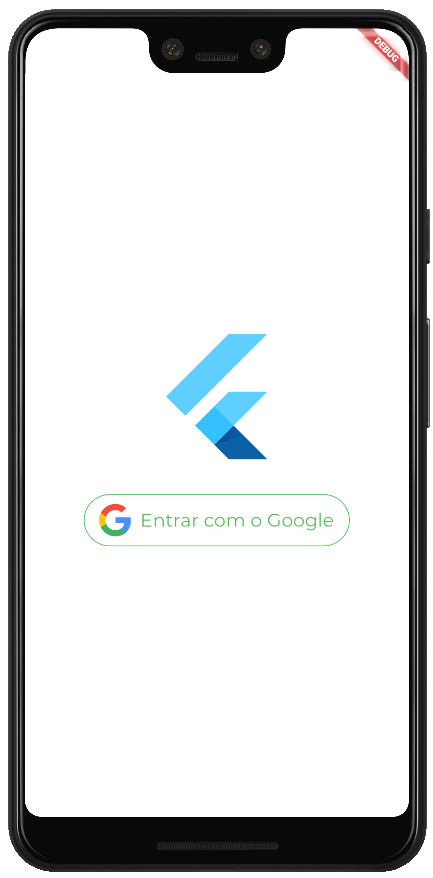
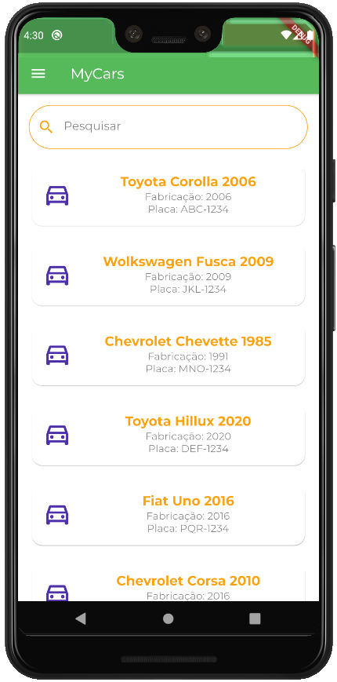
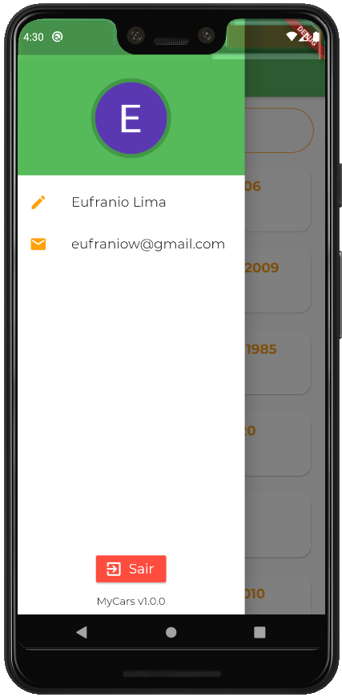
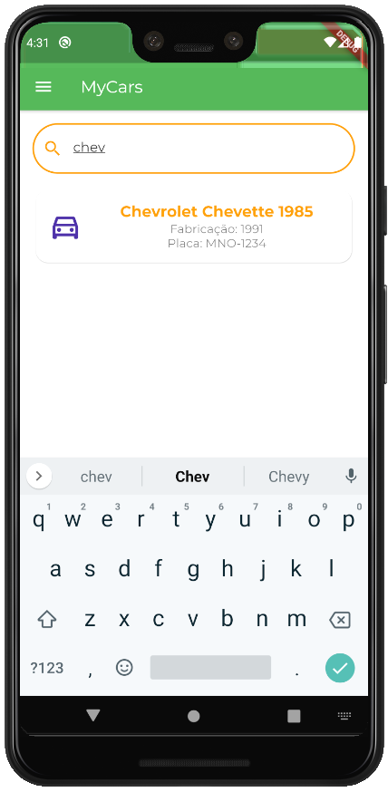

# mycars

MyCars is a Flutter app project powered by Google Auth and Firebase Firestore, which retrieves and 
displays the user data and pre-defined cars from a Firestore database for authenticated users, as well as 
authentication handling and searching through the registered cars.

This project is also an example of implementation of Google Auth and Firestore using certain 
features from the BLoC (recommended by Google) and MVC design patterns.

## Screenshots

## Getting Started
For help getting started with Flutter, view the online [documentation](http://flutter.io/).